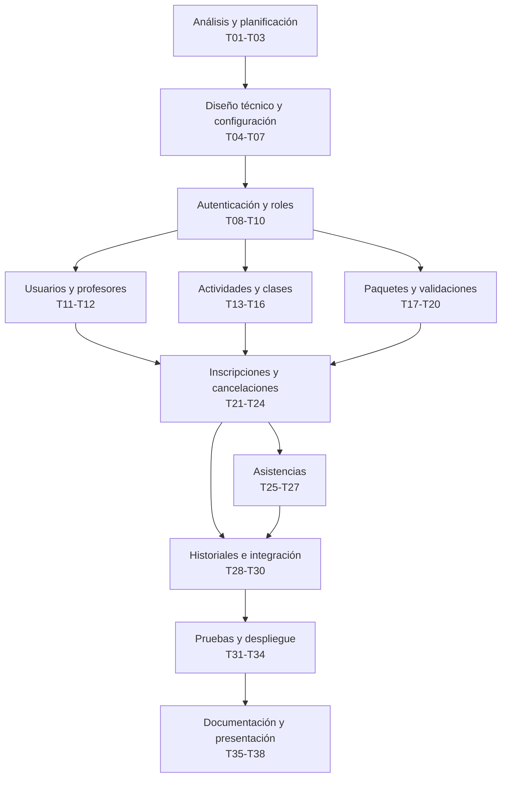

# GymFlow 🏋️‍♂️

> **Trabajo Final Integrador (TFI)**  
> Tecnicatura Universitaria en Programación a Distancia (TUPaD)

---

## 👥 Integrantes
- **Giselle Chaumont Mohr**
- **Emilia Gómez Juárez**

- **Tutor asignado:** Santiago Fonzo
- **Fecha de entrega propuesta:** 30/08/2026

---

## Repositorio oficial

<https://github.com/gisellechaumont/trabajofinalintegrador-tupad>

## 1. Resumen del proyecto e introducción

GymFlow es una aplicación web tipo SPA (*Single Page Application*) con API REST desacoplada. El sistema permitirá centralizar la administración de usuarios, profesores, paquetes o planes, clases, horarios, inscripciones, cupos y registros de asistencia.

La propuesta ofrece una solución ágil y moderna, accesible desde cualquier navegador web, desarrollada como una aplicación académica sustentada en una necesidad concreta del medio local.

## 2. Planteamiento del problema y justificación

En establecimientos deportivos pequeños, la falta de un sistema centralizado genera diversos inconvenientes operativos:

- Dificultad para mantener actualizada la información de socios y profesores.
- Inscripciones duplicadas o realizadas cuando una clase ya alcanzó su cupo máximo.
- Falta de control riguroso sobre los cupos disponibles en tiempo real.
- Poca visibilidad sobre los planes o paquetes contratados y sus respectivos vencimientos.
- Registros de asistencia incompletos o de difícil consulta para el profesorado y administración.
- Dependencia de una persona específica para responder consultas sobre disponibilidad.
- Pérdida de tiempo en tareas administrativas manuales y repetitivas.

| Actor afectado | Impacto del problema |
| --- | --- |
| Responsable o propietario | Dificultad para obtener una visión general y actualizada sobre clases, cupos, paquetes y asistencias, limitando la toma de decisiones informada. |
| Personal administrativo | Sobrecarga de tareas manuales repetitivas, necesidad de consultar múltiples fuentes y riesgo de registrar datos inconsistentes. |
| Profesor | Posibilidad de recibir listados de inscriptos desactualizados y falta de un registro ágil de asistencia. |
| Socio | Demoras para consultar horarios, dependencia de canales de atención y riesgo de inconsistencia sobre sus créditos o reservas. |

## Evaluación competitiva preliminar

Para determinar el posicionamiento de GymFlow se realizó una comparación preliminar con dos tipos de alternativas: las herramientas manuales utilizadas por establecimientos pequeños y los sistemas comerciales especializados en gestión de gimnasios.

La comparación no busca demostrar que GymFlow supera a las soluciones existentes, sino identificar qué necesidad cubre, cuáles son sus diferencias y qué limitaciones presenta.

| Alternativa                 | Funcionalidades principales                                                                                   | Ventajas                                                                                                  | Limitaciones respecto del público objetivo                                                                                      |
| --------------------------- | ------------------------------------------------------------------------------------------------------------- | --------------------------------------------------------------------------------------------------------- | ------------------------------------------------------------------------------------------------------------------------------- |
| Planillas, papel y WhatsApp | Registro manual de socios, clases, cupos, pagos y asistencias                                                 | Bajo costo inicial, herramientas conocidas y alta flexibilidad informal                                   | Información distribuida, controles manuales, menor trazabilidad y dependencia del personal administrativo                       |
| Midu                        | Reservas, membresías, pagos, facturación ARCA, control de acceso y aplicación para socios                     | Solución adaptada al mercado argentino e integración de procesos administrativos y comerciales            | Incluye funcionalidades que exceden el MVP y requiere contratar e implementar un servicio externo                               |
| Fitco                       | Reservas, membresías, pagos, clases, gestión de equipo, check-in y acceso mediante web o aplicación           | Plataforma integral orientada a estudios y centros deportivos                                             | Su alcance comercial es mayor que el requerido por establecimientos que solo necesitan gestionar clases, paquetes y asistencias |
| Trainingym                  | Reservas, control de capacidad, listas de espera, cancelaciones, notificaciones, informes y control de acceso | Alto nivel de automatización y herramientas para analizar la actividad del establecimiento                | Mayor amplitud funcional, configuración y dependencia de un proveedor comercial                                                 |
| GymFlow                     | Usuarios y roles, paquetes, clases, cupos, inscripciones, cancelaciones y asistencias                         | Alcance acotado, adaptación a las reglas del establecimiento y centralización de los procesos principales | No incluye pagos, facturación, aplicación móvil, notificaciones, listas de espera ni soporte comercial                          |

Midu se presenta como una solución desarrollada para Argentina e incorpora reservas, paquetes, cobros, facturación ARCA, control de acceso y una aplicación para socios ([Midu, s. f.](https://midu.app/)). Fitco permite gestionar reservas, membresías, pagos, clases y equipos, además de ofrecer acceso mediante web y aplicación ([Fitco, s. f.](https://www.fitcolatam.com/)). Trainingym agrega funciones como control de capacidad, listas de espera, notificaciones, cancelaciones e informes de ocupación ([Trainingym, s. f.](https://trainingym.com/reservas)).

Estas plataformas poseen mayor madurez y cobertura funcional que GymFlow. Sin embargo, también incorporan procesos comerciales, administrativos y de infraestructura que quedan fuera del alcance definido para el proyecto, como pagos, facturación, comunicaciones automáticas y controles físicos de acceso.

### Posicionamiento de GymFlow

El competidor más directo de GymFlow es el proceso manual basado en planillas, registros en papel y mensajería. Frente a esta modalidad, la propuesta centraliza la información, automatiza el control de cupos e inscripciones, valida la vigencia y disponibilidad de los paquetes y brinda acceso diferenciado a administradores, profesores y socios.

Su diferenciación se encuentra en un alcance reducido y adaptable, centrado en la gestión de clases con cupos y sin funcionalidades comerciales que aumentarían la complejidad del MVP. Sin embargo, GymFlow todavía no es un producto comercial ni cuenta con evidencia de adopción, soporte operativo o validación en un establecimiento real. Por ello, su valor frente al proceso manual deberá comprobarse mediante relevamiento y pruebas con usuarios potenciales.

## 3. Objetivos del proyecto

### 3.1. Objetivo general

Desarrollar una aplicación web (Frontend React + Backend Node.js) que permita administrar las actividades principales de un gimnasio, centralizando la información de usuarios, profesores, planes, clases, inscripciones, cupos y asistencias.

### 3.2. Objetivos específicos

- Permitir el acceso al sistema mediante usuarios debidamente autenticados con tokens JWT.
- Diferenciar las funcionalidades disponibles según los roles: Administrador, Profesor y Socio.
- Registrar, modificar, consultar y desactivar socios y profesores.
- Administrar los planes o paquetes de clases ofrecidos por el establecimiento.
- Programar clases indicando actividad, profesor, fecha, horario y cupo máximo permitido.
- Permitir a los socios consultar la disponibilidad de clases e inscribirse o cancelar de forma autónoma desde una interfaz React intuitiva.
- Evitar reservas duplicadas o por encima del cupo asignado a través de validaciones backend robustas.
- Proveer un módulo interactivo para que los profesores registren la presencia o ausencia en sus clases.
- Implementar un panel informativo para la consulta operativa de la administración.
- Desplegar el Frontend y Backend en entornos online accesibles en la nube (Vercel y Render).
- Documentar la arquitectura, API REST, base de datos y funcionamiento general en el repositorio único.

## 4. Usuarios y roles del sistema

| Rol | Responsabilidad | Funciones principales |
| --- | --- | --- |
| Administrador | Gestión general del gimnasio. | Administrar socios, profesores y planes; crear clases; asignar profesores; supervisar cupos, inscripciones y asistencias; acceder al panel general. |
| Profesor | Gestión operativa de sus clases. | Consultar clases asignadas, visualizar lista de inscriptos y registrar presencia o ausencia. |
| Socio | Autogestión de su actividad deportiva. | Consultar estado de su plan, ver clases y cupos disponibles en tiempo real, reservar/cancelar clases y consultar historial. |

## 5. Alcance funcional (MVP) y exclusiones

### 5.1. Módulos incluidos

- **Autenticación y roles:** Inicio/cierre de sesión seguro con tokens JWT y control de rutas privadas en React.
- **Gestión de usuarios:** Altas, modificaciones, activación/desactivación de socios y profesores.
- **Gestión de planes/paquetes:** Creación y asignación manual de paquetes, con fecha de inicio, vencimiento y clases disponibles.
- **Gestión de clases y cupos:** Programación de actividades con fechas, horarios, profesores y límites de cupo con validaciones estrictas en la API backend.
- **Inscripciones y cancelaciones:** Reserva autónoma, liberación automática de cupo ante cancelación y bloqueo por cupo lleno.
- **Control de asistencia:** Registro ágil de presencia/ausencia e historial por socio y clase.
- **Panel informativo administrativo:** Métricas operativas básicas: socios activos, clases llenas y vencimientos próximos.

### 5.2. Exclusiones explícitas del MVP

Para garantizar la viabilidad y calidad en los plazos estipulados, quedan fuera del alcance:

- Procesamiento de pagos online o pasarelas.
- Facturación electrónica.
- Aplicación móvil nativa.
- Integración con molinetes o biometría.
- Rutinas de entrenamiento o planes nutricionales.
- Listas de espera automáticas.
- Reportes contables complejos.

## 6. Reglas de negocio principales

- **RN-01:** Un usuario debe estar activo y autenticado para operar en el sistema.
- **RN-02:** Cada usuario opera estrictamente según los permisos asignados a su rol.
- **RN-03:** Solo el Administrador puede dar de alta usuarios, planes y programar clases.
- **RN-04:** El Profesor solo puede visualizar y registrar asistencia en las clases que tiene asignadas.
- **RN-05:** El Socio únicamente puede consultar y modificar sus propias reservas y estado del paquete.
- **RN-06:** No se permite la inscripción duplicada de un socio en una misma clase.
- **RN-07:** Una clase no puede superar su cupo máximo configurado.
- **RN-08:** Al cancelarse una inscripción válida, el cupo queda inmediatamente liberado.
- **RN-09:** Para realizar una inscripción, el socio debe contar con un paquete activo y clases disponibles.
- **RN-10:** La asistencia sólo puede registrarse para socios debidamente inscriptos en la clase.
- **RN-11:** Todas las validaciones de negocio críticas se ejecutan y resuelven en el backend.

## 7. Stack tecnológico y arquitectura propuesta

Se adopta una arquitectura desacoplada Cliente-Servidor (SPA + API REST), que permite una experiencia de usuario fluida y reactiva en el Frontend (React), mientras el Backend (Node.js) procesa la lógica de negocio y persistencia.

| Componente | Tecnología seleccionada | Descripción / Rol |
| --- | --- | --- |
| Frontend (SPA) | React (JavaScript / CSS / Tailwind o Bootstrap) | Interfaz de usuario modular, interactiva y responsive basada en componentes. |
| Backend (API REST) | Node.js  | Servicio backend para procesamiento de reglas de negocio, endpoints REST y autenticación. |
| Base de datos | Base de datos relacional SQL (MySQL / PostgreSQL) | Persistencia relacional robusta con soporte transaccional y claves foráneas. |
| Plataforma Cloud (Hosting) | Vercel (Frontend) / Render (Backend y DB) | Despliegue online continuo y desacoplado para garantizar alta disponibilidad. |
| Control de versiones | Git y GitHub | Repositorio único y gestión ágil de tareas (Issues / Projects). |

## 8. Organización del trabajo, metodología y comunicación

### 8.1. Metodología de trabajo y gestión de tareas

El equipo implementará un flujo de trabajo ágil basado en la metodología Kanban a través de Trello y/o GitHub Projects.

- **Backlog / Por hacer:** Requerimientos, diseño de interfaces, endpoints de la API y tareas técnicas pendientes.
- **En progreso:** Tareas que se encuentran en desarrollo activo por cada integrante.
- **En revisión / Testing:** Funcionalidades listas para validación cruzada y pruebas de integración.
- **Completado:** Tareas finalizadas, testeadas e integradas a la rama principal.

### 8.2. Flujo de trabajo con control de versiones

- **Rama principal (`main`):** Código estable y versiones entregables o desplegadas.
- **Ramas por funcionalidad (`feature branches`):** Cada integrante desarrollará módulos específicos de forma aislada, integrando el código mediante Pull Requests con revisión previa.

### 8.3. Documentación y estandarización

Toda la documentación técnica, funcional y de entregas residirá dentro de la carpeta `/docs` del repositorio único. También se mantendrá un archivo `README.md` con instrucciones de configuración local, variables de entorno de ejemplo, scripts SQL de inicialización y credenciales de prueba.

### 8.4. Canales de comunicación y seguimiento

- **Seguimiento con el tutor:** Mensajería del campus virtual o Discord y reuniones sincrónicas cada 15 días por Google Meet.
- **Coordinación interna del equipo:** Comunicación diaria y reuniones virtuales cortas para sincronización de tareas y resolución de bloqueos.

## 9. Estructura del repositorio único

```text
gymflow/
├── frontend/
├── backend/
├── database/
├── docs/
├── README.md
└── .gitignore
```

## 10. Plan de trabajo y cronograma de entregas

| Período / Hito | Actividades comprometidas | Entregable asociado |
| --- | --- | --- |
| 10/08 al 30/08 | Definición del problema, alcance y tecnologías (React + Node.js). Creación y estructura del repositorio en GitHub. | 1.ª Entrega Formal |
| 31/08 al 07/09 | Relevamiento detallado de requerimientos, historias de usuario y diseño de prototipos de interfaz en React. | Avance de diseño |
| 08/09 al 27/09 | Diseño del esquema de base de datos relacional (PostgreSQL / Prisma) y definición de módulos de la API. Aprobación con el tutor. | 2.ª Entrega Formal |
| 28/09 al 19/10 | Configuración de entornos, autenticación JWT, desarrollo de pantallas y endpoints para usuarios, profesores, planes y clases. | Sprint de desarrollo 1 |
| 20/10 al 02/11 | Implementación del circuito de inscripciones, control de cupos en tiempo real, cancelaciones y módulo de asistencia. | Sprint de desarrollo 2 |
| 03/11 al 09/11 | Pruebas integrales de integración Frontend-Backend, corrección de bugs y despliegue final en la nube (Vercel / Render). | Despliegue Cloud |
| 10/11 al 14/11 | Elaboración del informe técnico final, actualización del README y grabación del video explicativo. | Entrega Final |

## Cronograma detallado

El período comprendido entre el 10/08 y el 30/08 correspondió a la definición inicial del problema, el alcance, el stack tecnológico y la creación del repositorio. La planificación siguiente abarca desde el 31/08 hasta la entrega final del 14/11.

Se estima una dedicación promedio de seis horas semanales por integrante. Las horas indicadas incluyen análisis, implementación, pruebas, revisión y corrección.

### Dependencias generales



Los módulos de usuarios, actividades y paquetes podrán desarrollarse parcialmente en paralelo después de implementar la autenticación. Las inscripciones requieren que usuarios, clases y paquetes estén disponibles. Las asistencias dependen de las clases y de las inscripciones. El despliegue final se realizará después de completar las pruebas integrales.

### Cronograma de tareas

En la distribución se utiliza:

* **R:** responsable principal.
* **C:** colaboración o revisión.
* **Conjunta:** responsabilidad compartida.

| ID  | Período     | Tarea concreta                                                                |                     Emilia |                        Giselle | Complejidad | Depende de              |
| --- | ----------- | ----------------------------------------------------------------------------- | -------------------------: | -----------------------------: | ----------- | ----------------------- |
| T01 | 31/08–07/09 | Refinar historias de usuario y criterios de aceptación                        |              3 h, conjunta |                  3 h, conjunta | Media       | —                       |
| T02 | 31/08–07/09 | Diseñar flujos y wireframes por rol                                           | 2 h, R socio/autenticación | 2 h, R administración/profesor | Media       | T01                     |
| T03 | 31/08–07/09 | Priorizar el backlog y definir entregables del MVP                            |              1 h, conjunta |                  1 h, conjunta | Baja        | T01                     |
| T04 | 08/09–14/09 | Definir entidades, relaciones y modelo de datos                               |              3 h, conjunta |                  3 h, conjunta | Alta        | T01                     |
| T05 | 08/09–14/09 | Crear esquema inicial de PostgreSQL y Prisma                                  |                     1 h, C |                         2 h, R | Alta        | T04                     |
| T06 | 08/09–14/09 | Definir endpoints, respuestas y errores de la API                             |                     2 h, R |                         1 h, C | Alta        | T01, T04                |
| T07 | 15/09–21/09 | Crear proyectos base y configurar entornos locales                            |            3 h, R frontend |                 3 h, R backend | Alta        | T04, T06                |
| T08 | 15/09–21/09 | Implementar inicio de sesión y generación de JWT                              |                     2 h, R |                         1 h, C | Alta        | T05, T07                |
| T09 | 15/09–21/09 | Crear pantalla de acceso y gestión del token                                  |                     1 h, C |                         2 h, R | Alta        | T07, T08                |
| T10 | 22/09–27/09 | Implementar permisos backend y rutas protegidas por rol                       |                     3 h, R |                         1 h, C | Alta        | T08, T09                |
| T11 | 22/09–27/09 | Crear API para altas, consultas, modificaciones y desactivaciones de usuarios |                     2 h, R |                         2 h, C | Alta        | T05, T10                |
| T12 | 22/09–27/09 | Crear interfaces de administración de socios y profesores                     |                     1 h, C |                         3 h, R | Media       | T11                     |
| T13 | 28/09–04/10 | Crear API para administrar actividades                                        |                     1 h, C |                         2 h, R | Media       | T05, T10                |
| T14 | 28/09–04/10 | Crear interfaz para administrar actividades                                   |                     1 h, R |                         1 h, C | Media       | T13                     |
| T15 | 28/09–04/10 | Crear API para programar, modificar y cancelar clases                         |                     2 h, C |                         2 h, R | Alta        | T11, T13                |
| T16 | 28/09–04/10 | Crear interfaz y calendario básico de clases                                  |                     2 h, R |                         1 h, C | Media       | T15                     |
| T17 | 05/10–11/10 | Crear API para tipos de paquetes, asignación, vigencia y saldo                |                     1 h, C |                         3 h, R | Alta        | T05, T10                |
| T18 | 05/10–11/10 | Crear interfaces para administrar y consultar paquetes                        |                     2 h, R |                         1 h, C | Media       | T17                     |
| T19 | 05/10–11/10 | Validar profesor asignado y cupo máximo de cada clase                         |                     2 h, R |                         1 h, C | Alta        | T11, T15                |
| T20 | 05/10–11/10 | Probar la integración entre clases y paquetes                                 |              1 h, conjunta |                  1 h, conjunta | Alta        | T16, T17, T18, T19      |
| T21 | 12/10–19/10 | Implementar inscripción con validación de cupo, duplicación y paquete         |                     2 h, C |                         3 h, R | Alta        | T11, T17, T19           |
| T22 | 12/10–19/10 | Crear interfaz de disponibilidad e inscripción del socio                      |                     2 h, R |                         1 h, C | Alta        | T21                     |
| T23 | 12/10–19/10 | Implementar cancelación y liberación del cupo                                 |                     1 h, C |                         1 h, R | Alta        | T21, T22                |
| T24 | 12/10–19/10 | Probar inscripciones, rechazos y cancelaciones                                |              1 h, conjunta |                  1 h, conjunta | Alta        | T21, T23                |
| T25 | 20/10–26/10 | Crear API para registrar asistencias e inasistencias                          |                     3 h, R |                         1 h, C | Alta        | T15, T21                |
| T26 | 20/10–26/10 | Crear lista de inscriptos e interfaz de asistencia del profesor               |                     2 h, R |                         2 h, C | Alta        | T12, T25                |
| T27 | 20/10–26/10 | Probar permisos y registros de asistencia                                     |                     1 h, C |                         3 h, R | Alta        | T10, T25, T26           |
| T28 | 27/10–02/11 | Implementar historiales básicos por socio y clase                             |                     2 h, R |                         1 h, C | Media-alta  | T21, T25                |
| T29 | 27/10–02/11 | Implementar consultas básicas del panel administrativo                        |                     1 h, C |                         2 h, R | Media       | T12, T16, T18, T28      |
| T30 | 27/10–02/11 | Integrar y probar el circuito completo del sistema                            |              3 h, conjunta |                  3 h, conjunta | Alta        | T20, T24, T27, T28, T29 |
| T31 | 03/11–09/11 | Ejecutar pruebas críticas y corregir errores                                  |                     3 h, R |                         2 h, C | Alta        | T30                     |
| T32 | 03/11–09/11 | Configurar y desplegar el frontend                                            |                     2 h, R |                              — | Media       | T31                     |
| T33 | 03/11–09/11 | Configurar y desplegar el backend y la base de datos                          |                          — |                         3 h, R | Alta        | T31                     |
| T34 | 03/11–09/11 | Ejecutar pruebas de humo y documentar ejecución local alternativa             |              1 h, conjunta |                  1 h, conjunta | Alta        | T32, T33                |
| T35 | 10/11–14/11 | Actualizar README y documentación de la API                                   |                     3 h, R |                         1 h, C | Media       | T31, T34                |
| T36 | 10/11–14/11 | Documentar arquitectura, base de datos y despliegue                           |                     1 h, C |                         3 h, R | Media       | T34                     |
| T37 | 10/11–14/11 | Preparar datos de prueba y guion de demostración                              |              1 h, conjunta |                  1 h, conjunta | Media       | T34                     |
| T38 | 10/11–14/11 | Grabar el video y realizar la revisión final                                  |              1 h, conjunta |                  1 h, conjunta | Media       | T35, T36, T37           |

### Distribución de carga

| Etapa                                    |   Emilia |  Giselle |
| ---------------------------------------- | -------: | -------: |
| Análisis y planificación                 |      6 h |      6 h |
| Diseño técnico y configuración           |     18 h |     18 h |
| Desarrollo de módulos principales        |     18 h |     18 h |
| Inscripciones, asistencias e integración |     12 h |     12 h |
| Pruebas y despliegue                     |      6 h |      6 h |
| Documentación y presentación             |      6 h |      6 h |
| **Total**                                | **66 h** | **66 h** |

Emilia tiene asignadas aproximadamente 42 horas de tareas de complejidad alta y Giselle 43 horas. La diferencia restante corresponde a tareas de complejidad media o baja. De esta manera, la carga total y la dificultad técnica se distribuyen de forma equivalente.

La mayor experiencia técnica de Giselle se aprovechará en la configuración de la base de datos, las inscripciones y el despliegue. Emilia será responsable de autenticación, permisos, usuarios y asistencias, con participación de Giselle en las revisiones. Ambas trabajarán tanto en frontend como en backend.

### Flujo de trabajo para cada tarea

1. La tarea comienza cuando sus dependencias están terminadas e integradas en `main`.
2. La responsable actualiza `main` y crea una rama con el identificador de la tarea, por ejemplo: `feature/T21-inscripciones`.
3. La implementación se divide en commits específicos.
4. La colaboradora revisa el código y ejecuta las pruebas correspondientes.
5. Se abre un pull request y se corrigen las observaciones.
6. La tarea se integra a `main`.
7. Las tareas dependientes quedan habilitadas para comenzar.

Al finalizar cada semana, ambas integrantes revisarán las horas utilizadas, las tareas completadas y los bloqueos. Si una tarea se atrasa, se actualizará su estimación antes de iniciar una funcionalidad que dependa de ella.

## Link a Trello

<https://trello.com/invite/b/6a9b1e2cb8b6fb77d8bf0aa1/ATTId5260eccc0b730825c9f66583a051fa9B8418573/gymflow-tfi>

## Riesgos y mitigaciones

Se identifican los principales eventos que podrían afectar el alcance, los plazos o la calidad de GymFlow. Para cada riesgo se establece una medida preventiva y una respuesta en caso de que ocurra.

| Código | Riesgo                                                                 | Probabilidad | Impacto | Mitigación                                                                                                    | Contingencia                                                                           |
| ------ | ---------------------------------------------------------------------- | -----------: | ------: | ------------------------------------------------------------------------------------------------------------- | -------------------------------------------------------------------------------------- |
| R-01   | Atraso del cronograma                                                  |        Media |    Alto | Dividir el trabajo en tareas pequeñas, estimar horas y controlar semanalmente el avance                       | Replanificar las tareas y reducir funcionalidades secundarias                          |
| R-02   | Disponibilidad limitada de alguna integrante                           |        Media |    Alto | Distribuir el conocimiento, documentar avances y evitar que una función dependa exclusivamente de una persona | Redistribuir las tareas y priorizar los módulos centrales                              |
| R-03   | Dificultades en la integración entre frontend, backend y base de datos |        Media |    Alto | Definir los contratos de la API y probar anticipadamente un flujo completo                                    | Simplificar componentes no esenciales y concentrar el trabajo en el circuito principal |
| R-04   | Incorporación de funcionalidades fuera del MVP                         |        Media |    Alto | Registrar las propuestas nuevas en el backlog y evaluar su impacto antes de aprobarlas                        | Postergar las funciones que no formen parte del alcance acordado                       |
| R-05   | Fallas en los servicios de despliegue                                  |        Media |    Alto | Realizar despliegues preliminares y mantener documentada la ejecución local                                   | Ejecutar la demostración localmente o utilizar un proveedor alternativo                |
| R-06   | Errores en las reglas de negocio o en la integridad de los datos       |        Media |    Alto | Aplicar validaciones backend, restricciones en la base de datos y pruebas sobre los procesos críticos         | Detener el despliegue de la función afectada hasta corregirla y volver a probarla      |

### Caso R-01: Atraso del cronograma

El riesgo R-01 se considerará materializado si, al finalizar el primer sprint de desarrollo, todavía no se encuentran integradas la autenticación y la gestión básica de usuarios, clases y paquetes.

Ante esta situación se aplicará el siguiente plan:

1. Suspender la incorporación de nuevas funcionalidades.
2. Identificar las tareas que generan el atraso y redistribuirlas entre las integrantes.
3. Recortar primero el panel de métricas administrativas, conservando únicamente las consultas básicas.
4. Si el atraso continúa, simplificar los historiales a listados básicos, sin filtros ni indicadores adicionales.
5. Actualizar el cronograma y comunicar el ajuste al tutor.

Se mantendrán las funciones necesarias para el circuito principal: autenticación y roles, gestión de usuarios, clases y paquetes, control de cupos, inscripciones, cancelaciones y asistencias. Tampoco se recortarán las validaciones backend, la integridad de los datos ni las pruebas de los procesos críticos.


## 11. Viabilidad y conclusión

La elección de una arquitectura desacoplada con React en el Frontend y Node.js en el Backend ofrece un estándar profesional de la industria, garantizando una excelente experiencia interactiva para socios y profesores, con validaciones firmes en el servidor.

La propuesta es completamente viable de ejecutar en los plazos académicos previstos.
