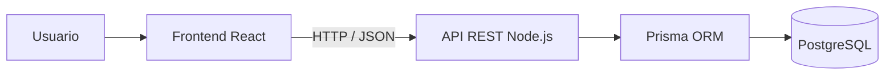
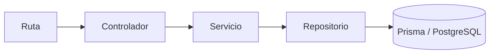
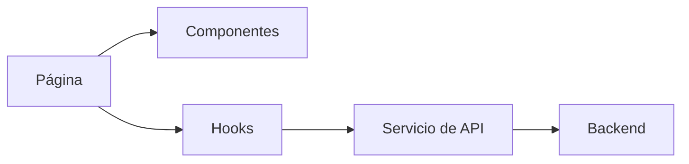

# Arquitectura y Stack tecnológico

GymFlow se desarrollará como una aplicación cliente-servidor desacoplada, compuesta por una aplicación frontend de tipo SPA y una API REST backend. Ambos componentes se mantendrán dentro de un único repositorio, pero funcionarán como aplicaciones independientes y se comunicarán mediante peticiones HTTP con datos en formato JSON.

| Componente | Tecnología seleccionada | Responsabilidad |
| --- | --- | --- |
| Frontend | React + TypeScript | Construcción de la interfaz, navegación, formularios, visualización de información y consumo de la API |
| Backend | Node.js + Express + TypeScript | Exposición de endpoints REST, autenticación, autorización y ejecución de las reglas de negocio |
| Persistencia | PostgreSQL | Almacenamiento relacional con integridad referencial y soporte transaccional |
| Acceso a datos | Prisma ORM | Definición del modelo, migraciones y comunicación entre el backend y PostgreSQL |
| Autenticación | JWT | Identificación del usuario y protección de operaciones privadas |
| Despliegue | Vercel / Render | Publicación independiente del frontend, backend y base de datos |
| Control de versiones | Git y GitHub | Repositorio único, ramas de trabajo, revisión mediante pull requests y trazabilidad de cambios |
| Gestión del proyecto | Trello | Organización del backlog y seguimiento del estado de las tareas |

### Justificación del stack tecnológico y arquitectura

* **Arquitectura Desacoplada (SPA + API REST):** Separa claramente las responsabilidades visuales de la lógica de negocio, optimiza la velocidad de navegación del usuario sin recargas completas y desacopla el cliente para eventuales extensiones futuras (como una app móvil).
* **Frontend (React):** Facilita la construcción de interfaces dinámicas y modulares basadas en componentes reutilizables (tablas de horarios, calendarios de disponibilidad, modales de confirmación) y un manejo de estado reactivo para actualizar cupos en tiempo real.
* **Backend (Node.js):** Ofrece un modelo asíncrono y no bloqueante idóneo para soportar múltiples consultas e inscripciones concurrentes, aprovechando el mismo lenguaje (JavaScript) en todo el ciclo de desarrollo para mayor agilidad y cohesión en el equipo.
* **Base de Datos Relacional SQL (MySQL / PostgreSQL):** La naturaleza del negocio exige consistencia estricta. El modelo relacional asegura integridad referencial mediante claves foráneas y garantiza transacciones ACID para evitar condiciones de carrera (*race conditions*) cuando dos socios intentan reservar el último cupo en simultáneo.
* **Plataformas Cloud (Vercel y Render):** Permiten un despliegue continuo integrado a GitHub con costos nulos para la etapa académica y alta disponibilidad para la evaluación del proyecto.

### Arquitectura general

La arquitectura se divide en tres componentes principales:

1. **Frontend:** aplicación React ejecutada en el navegador.
2. **Backend:** API REST desarrollada con Node.js y Express.
3. **Base de datos:** PostgreSQL, accedida exclusivamente desde el backend mediante Prisma.



El frontend no accederá directamente a la base de datos. Todas las operaciones se realizarán a través de la API REST, que validará la identidad, los permisos y las reglas de negocio antes de consultar o modificar la información persistida.

La interfaz podrá realizar validaciones para orientar al usuario, pero las reglas críticas —como el control de cupos, la vigencia de los paquetes y el descuento o devolución de créditos— se ejecutarán nuevamente en el backend.

### Arquitectura del backend

El backend se implementará como un **monolito modular organizado por funcionalidades, con capas internas según responsabilidad**.

Se elige un monolito modular porque el proyecto posee un alcance acotado, será desarrollado por dos integrantes y no requiere la complejidad operativa de una arquitectura de microservicios. El sistema tendrá una única API desplegable, pero su código estará dividido en módulos funcionales con responsabilidades delimitadas.

Los módulos principales serán:

- autenticación y autorización;
- usuarios;
- actividades;
- clases y cupos;
- planes y paquetes;
- inscripciones y cancelaciones;
- asistencias;
- panel administrativo.

Dentro de cada módulo se aplicará una arquitectura por capas:

| Capa | Responsabilidad |
| --- | --- |
| Rutas | Asociar los métodos y direcciones HTTP con el controlador correspondiente |
| Controladores | Recibir la petición, extraer sus datos y construir la respuesta HTTP |
| Servicios | Ejecutar los casos de uso y las reglas de negocio |
| Repositorios | Encapsular las operaciones de persistencia realizadas mediante Prisma |
| Validaciones | Verificar el formato y los datos de entrada antes de ejecutar el caso de uso |
| Tipos | Definir las estructuras de TypeScript utilizadas por el módulo |

El flujo general de una petición será:



Las dependencias se dirigirán desde las capas externas hacia las internas:

- una ruta podrá utilizar un controlador;
- un controlador podrá utilizar un servicio;
- un servicio podrá utilizar uno o más repositorios;
- un repositorio realizará las consultas mediante Prisma.

La lógica de negocio no se colocará en las rutas, los controladores ni los componentes de React. Se concentrará en los servicios para evitar duplicaciones y facilitar las pruebas.

#### Elementos compartidos del backend

Además de los módulos funcionales, el backend tendrá componentes compartidos:

- configuración y variables de entorno;
- conexión con Prisma;
- middleware de autenticación;
- middleware de autorización por roles;
- manejo centralizado de errores;
- utilidades comunes;
- documentación de la API;
- pruebas.

Los middleware permitirán resolver aspectos transversales antes de que la petición llegue al controlador. Por ejemplo, el middleware de autenticación verificará el JWT y proporcionará la identidad del usuario; el middleware de autorización comprobará si su rol puede ejecutar la operación.

### Arquitectura del frontend

El frontend se organizará mediante una **arquitectura basada en componentes y agrupada por funcionalidades**.

React permite construir la interfaz a partir de componentes reutilizables. La organización por funcionalidades mantendrá juntos los elementos relacionados con cada parte del sistema, como páginas, formularios, servicios de comunicación y tipos.

Los principales grupos funcionales del frontend corresponderán a:

- autenticación;
- usuarios;
- actividades;
- clases;
- paquetes;
- inscripciones;
- asistencias;
- panel administrativo.

Cada funcionalidad podrá contener:

| Elemento | Responsabilidad |
| --- | --- |
| Páginas | Representar las vistas asociadas a una ruta de navegación |
| Componentes | Construir partes reutilizables de la interfaz |
| Servicios de API | Realizar peticiones HTTP al backend |
| Hooks | Reutilizar estado y comportamiento propio de React |
| Tipos | Definir los datos recibidos o enviados por la funcionalidad |
| Validaciones | Comprobar formularios y mostrar mensajes al usuario |

Los elementos compartidos entre varias funcionalidades, como botones, tablas, campos de formulario, diseños generales y el cliente HTTP, se ubicarán en un espacio común.

El flujo general del frontend será:



La navegación estará protegida según el estado de autenticación y el rol para evitar que el usuario visualice opciones que no le corresponden. Esta protección será únicamente una medida de interfaz: el backend volverá a validar todos los permisos.

Para el estado global se conservará únicamente la información que deba compartirse entre múltiples pantallas, como la sesión autenticada. El estado específico de formularios o páginas se mantendrá dentro de la funcionalidad correspondiente para evitar dependencias innecesarias.

### Patrones y criterios adoptados

La organización combina los siguientes enfoques:

- **Arquitectura cliente-servidor:** separa la interfaz de usuario de la lógica y la persistencia.
- **API REST:** define la comunicación entre frontend y backend mediante recursos, métodos HTTP y respuestas JSON.
- **Monolito modular:** mantiene una única aplicación backend desplegable, dividida internamente por funcionalidades.
- **Arquitectura en capas:** separa rutas, controladores, servicios y repositorios según su responsabilidad.
- **Repository Pattern:** concentra el acceso a datos y evita que las consultas de Prisma se distribuyan por controladores y servicios.
- **Service Layer:** concentra los casos de uso y las reglas de negocio.
- **Arquitectura basada en componentes:** divide la interfaz React en piezas reutilizables.
- **Organización por funcionalidades:** agrupa en un mismo lugar los elementos relacionados con cada módulo del negocio.
- **Flujo de datos unidireccional:** los datos y eventos de la interfaz siguen el modelo de React, facilitando el seguimiento de los cambios de estado.
- **Middleware:** resuelve tareas transversales del backend, como autenticación, autorización y manejo de errores.

Esta combinación se selecciona porque proporciona una separación clara de responsabilidades sin incorporar la complejidad de arquitecturas distribuidas. Además, facilita la división del trabajo, la revisión cruzada, las pruebas y la relación entre los módulos documentados y su implementación en el repositorio.

## Estructura del repositorio único

El proyecto se mantendrá en un monorepositorio. El frontend y el backend tendrán sus propias dependencias, configuración y comandos de ejecución.

```text
gymflow/
├── frontend/
│   ├── src/
│   │   ├── app/
│   │   │   ├── router/
│   │   │   └── providers/
│   │   ├── features/
│   │   │   ├── auth/
│   │   │   ├── users/
│   │   │   ├── activities/
│   │   │   ├── classes/
│   │   │   ├── packages/
│   │   │   ├── enrollments/
│   │   │   ├── attendance/
│   │   │   └── dashboard/
│   │   ├── shared/
│   │   │   ├── components/
│   │   │   ├── layouts/
│   │   │   ├── services/
│   │   │   └── types/
│   │   └── main.tsx
│   ├── tests/
│   └── package.json
│
├── backend/
│   ├── prisma/
│   │   ├── schema.prisma
│   │   └── migrations/
│   ├── src/
│   │   ├── config/
│   │   ├── middlewares/
│   │   ├── modules/
│   │   │   ├── auth/
│   │   │   ├── users/
│   │   │   ├── activities/
│   │   │   ├── classes/
│   │   │   ├── packages/
│   │   │   ├── enrollments/
│   │   │   ├── attendance/
│   │   │   └── dashboard/
│   │   ├── shared/
│   │   ├── app.ts
│   │   └── server.ts
│   ├── tests/
│   └── package.json
│
├── docs/
│   ├── propuesta-proyecto.md
│   ├── alcance-arquitectura-y-viabilidad.md
│   ├── gestion-y-planificacion.md
│   ├── modulos.md
│   └── base-de-datos.md
│
├── README.md
└── .gitignore
```

Cada carpeta de `backend/src/modules/` podrá incluir, cuando corresponda:

```text
nombre-modulo/
├── nombre.routes.ts
├── nombre.controller.ts
├── nombre.service.ts
├── nombre.repository.ts
├── nombre.validation.ts
└── nombre.types.ts
```

No todos los módulos deberán contener obligatoriamente todos estos archivos. Se crearán únicamente las capas necesarias para mantener una responsabilidad clara y evitar estructuras vacías o artificiales.

Cada carpeta de `frontend/src/features/` podrá incluir:

```text
nombre-funcionalidad/
├── components/
├── pages/
├── hooks/
├── services/
├── validations/
└── types/
```

Los nombres definitivos podrán ajustarse durante la implementación, pero se conservarán la organización modular y la separación de responsabilidades establecidas.